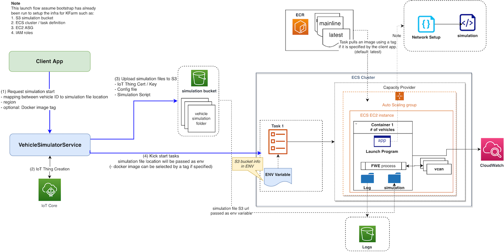

#Vehicle Simulator

This package provides user an easy way to create a fleet of virtual vehicles. 

The following diagram illustrates the vehicle launch process.



#User Guide

## On-boarding
TODO: CDK / CloudFormation

The following configuration will be setup during Onboarding:
1. S3 Simulation Bucket
2. ECS Cluster / Task definition
3. EC2 ASG with launch template

## Simulation Input
User should provide a map file containing each vehicle ID and its simulation file location. Vehicle Simulator service will
take this input and create IoT Things and upload to S3 simulation bucket.

The S3 bucket should contain the following folder structure
```
Top Folder
    |_ car1
        |_ private key
        |_ certificate
        |_ config.json
        |_ sim
            |_ simulation scripts

```
The Top folder url should be supplied to `LaunchVehicles` command

## Pre-requisite
Refresh AWS credential
```
ada credentials update --account 763496144766 --role Admin --once
```

## Create Vehicles
TODO define simulation mapping file format

Use option `LaunchVehicles` with `-s` followed by simulation mapping file and `-r` followed by region
```
brazil-runtime-exec vehicle-simulator LaunchVehicles -s simulation_file -r us-west-2
```

## Stop Vehicles
Use option `StopVehicles` and supply task ID following `-t` and `-r` followed by region. If there's multiple task IDs, use multiple `-t`
```
brazil-runtime-exec vehicle-simulator StopVehicles -t task1 -t task2 -t task3 -r us-west-2
```
